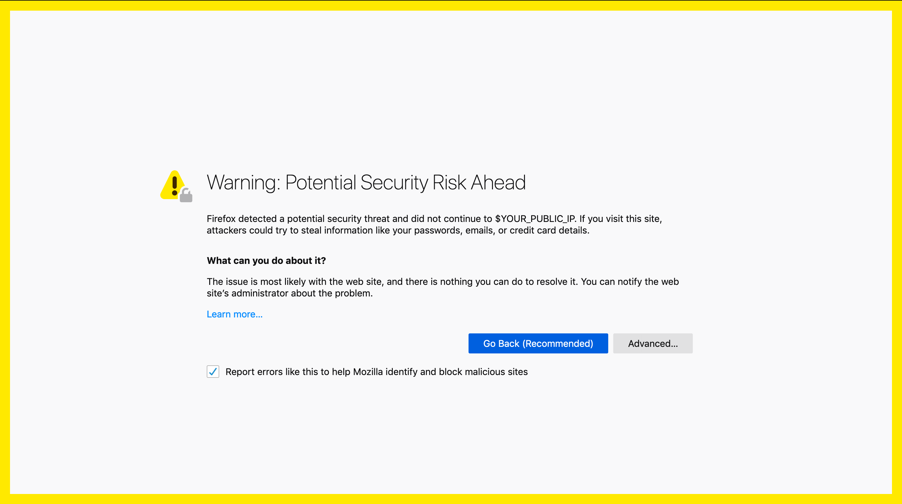

In the [first part or this series](../building-this-site-1) we built a simple website and forwarded port 80 on our server to the internet to publish it. Visiting the public IP of our local network in a browser now brings us to a simple website which we can update manually from our webserver by creating markdown, or html files and executing `hugo` to build it.

That's all well and good, but we currently have two issues:

1. We don't want people to have to manually navigate to our public IP address each time they visit our site
2. HTTP is insecure, so most modern browsers will throw a big warning to any viewer that reaches our site



In this post, we'll set about assigning our site a domain name and serve it over HTTPS.

## Step 0: Buy a Domain Name and Configure Cloudflare

In order to get a trusted X.509 certifcate to serve data over HTTPS, we need to have a publicly resolveable domain name. Fortunately, domain names are cheap and you can even get a [free one](https://www.freenom.com/) if you're not picky about what it is exactly.

Once you've got your domain name, it's a good idea to use [Cloudflare](https://www.cloudflare.com/) for the DNS nameservers for it, so you can utilise their content delivery network more easily if needed, and it will also help with obtaining a certificate from Let's Encrypt.

Once you've got your domain, created a Cloudflare account, and set the nameservers of your domain, you should enter your public IP into your Cloudflare account's DNS records before continuing. After about 15 minutes, you should be able to get to your site by visting `http://yourdomain.com` (although your browser will still throw a warning about HTTP).

## Step 1: Let's Encrypt

We're going to use `certbot` to obtain a HTTPS certificate for our server from [Let's Encrypt](https://letsencrypt.org/) for a couple of reasons:

* It's free and open source
* It can be scripted to automatically renew

Log into your server and execute the following command in a terminal, replacing `example.com` with your domain name and `your@email.com` with your email address:

```bash
sudo brew services nginx stop
sudo certbot certonly --standalone -d example.com -m your@email.com --agree-tos
```

Once that's completed successfully, we can configure our webserver to use the newly created certificate.

## Step 2: Reconfigure `nginx`

Open your `/usr/local/etc/nginx/nginx.conf` in your favourite text-editor and - ensuring you use your domain name in place of `example.com` - replace this:

```conf
server {
    root /absolute/path/to/your/hugo/website/public ## Replace this with your actual path
    listen       80 default_server;
    server_name  _;
```

With this:

```conf
gzip on;
server {
    listen       80 default_server;
    server_name  _; # This is a catch-all term so any HTTP request on port 80 will be redirected.
    return 301 https://$host$request_uri; # This redirects any requests using HTTP to HTTPS so that they are encrypted
    # Note: The above ISN'T example.com so leave this how it is.
}
 server {
    listen       443 ssl http2;
    server_name  example.com; # This is where you change example.com to your DNS domain name (website root URL)
     # This is where we set the webroot:
    root /absolute/path/to/your/hugo/website/public ## Replace this with your actual path

    # We'll use the Mozilla SSL config generator for SSL settings to make life easier:
    ssl_certificate      /etc/letsencrypt/live/example.com/fullchain.pem;
    ssl_certificate_key  /etc/letsencrypt/live/example.com/privkey.pem;
    ssl_dhparam /usr/local/etc/nginx/dhparam.pem;
     # intermediate configuration
    ssl_protocols TLSv1.2 TLSv1.3;
    ssl_ciphers ECDHE-ECDSA-AES128-GCM-SHA256:ECDHE-RSA-AES128-GCM-SHA256:ECDHE-ECDSA-AES256-GCM-SHA384:ECDHE-RSA-AES256-GCM-SHA384:ECDHE-ECDSA-CHACHA20-POLY1305:ECDHE-RSA-CHACHA20-POLY1305:DHE-RSA-AES128-GCM-SHA256:DHE-RSA-AES256-GCM-SHA384;
    ssl_prefer_server_ciphers off;
     # HSTS (ngx_http_headers_module is required) (63072000 seconds)
    add_header Strict-Transport-Security "max-age=63072000" always;
     # OCSP stapling
    ssl_stapling on;
    ssl_stapling_verify on;
    resolver 1.1.1.1 valid=86400;
     # Secure any cookies
    add_header Set-Cookie '$sent_http_set_cookie; HttpOnly; Secure;';

    # Add a content security policy for increased security
    add_header Content-Security-Policy "default-src 'none'; manifest-src 'self'; base-uri 'self'; form-action 'self'; script-src 'self' maxcdn.bootstrapcdn.com code.jquery.com; img-src 'self' data:; style-src 'self' fonts.googleapis.com; font-src 'self' fonts.gstatic.com data:; frame-src 'self'; connect-src 'self' https://apis.google.com; object-src 'none';";
```

We've now configured the site to use HTTPS, but we also added some extra settings in there to bring the encryption up to more modern standards. One of these settings refers to `dhparams.pem` (Diffie-Hellman parameters) - which we've not yet created.

We can build these using the following command:

```bash
sudo openssl dhparam -out /usr/local/etc/nginx/dhparam.pem 4096
```

We can now bring the webserver back online with:

```bash
sudo brew services nginx start
```

**Note:** You'll also need to forward port 443 on your machine to your firewall.

## Step 3: Set and Forget

Now we want to make sure `certbot` renews our certificates automatically so our site *stays trusted* without us having to renew the certificate every few months, we can do this with a `cron` job.

In a terminal, enter:

```bash
sudo crontab -e
```

Now at the bottom of that file, enter:

```bash
0 0 1 */2 * brew services nginx stop && /usr/local/bin/certbot renew && brew services nginx start
```

Now hit `ctrl` + `X` to exit, and `Y` and then `return` to save.

The renewal will now run at midnight on the 1^st day of every 2nd month, your site will be taken offline for a few seconds each time the renewal runs but will be brought back online after it's complete.

Now if we head to our new website we should be greeted with the same site from earlier, only now it's got a green padlock in the URL bar and isn't throwing a warning about being insecure!

You can also verify the SSL rating of your site by visiting <https://observatory.mozilla.org/> and scanning your domain name, at time of writing the configuration above should return an A+ rating indicating the site is using modern best-practices and is considered safe and trusted by browsers.

We'll look at `git` integration in a later post, but for now this should be enough to get you going with your fancy new website.
